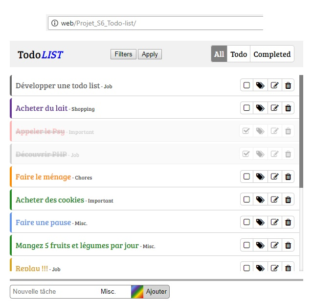

# Portfolio - Todolist
[> Page détaillé de l'exercice sur mon site <](neo-explorer.com/portfolio/todolist "Page de l'exercice sur mon site")

Cette todo list écrite en PHP exploite les superglobales $_GET et $_POST et l'utilisation des sessions pour gérer et stocker une liste de tâches.

## Principe
L'objectif de cet exercice était de manipuler les superglobales suivantes : $_GET, $_POST et $_SESSION, pour la création d'une todolist. Cette liste contient par défaut plusieurs tâches et chacunes d'entre elle possède :

* Une couleur
* Une catégorie
* Un état (todo ou completed)

Il est également possible de modifier ces informations, de créer de nouvelles tâches, de les filtrer ou encore de les supprimer grâce aux superglobales $_GET et $_POST. La variable $_SESSION quand à elle a été utilisé pour stocker ces changements/ajouts.

